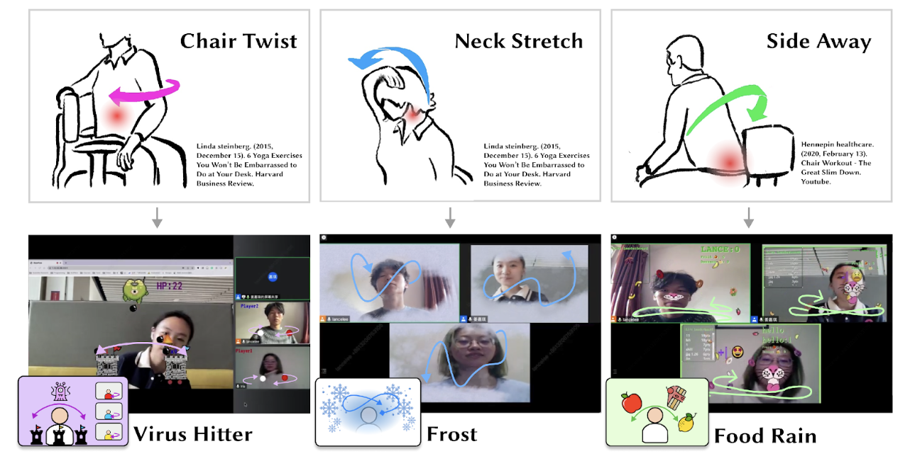

# 🎮 Gamified Bodily Interactions for Online Meetings 🎮

Welcome to our project, where we've developed three engaging and interactive games designed to promote physical activity and social bonding during online meetings! 🚀

## 📋 Overview

This web-based application, integrated with Open Broadcaster Software (OBS), offers a set of gamified experiences that can be streamed as a virtual camera to any online meeting platform (e.g., Zoom, VooV Meeting). As online meeting software evolves, these interactions have the potential to become add-on applications or integrated features, providing new ways for users to stay active and engaged.

## 🎲 Games

### Virus Hitter 🦠
A cooperative game where players take on the roles of a "hitter" and assistants:
- **Hitter**: Uses a torch attached to their nose to launch bombs at watchtowers.
- **Assistants**: Rotate their upper bodies from side to side to match the watchtower color.  
*Inspired by the "chair twist" and "side sway" exercises.*  

### Frost ❄️
Designed for online meetings, this game simulates frost forming on the video window. To clear the frost, participants must move their heads:
- **Mechanics**: Move any part of the body to "swipe" frost away from the screen.  
*Inspired by the "neck stretch" exercise.*  

### Food Rain 🍎🍩
A competitive game where players catch falling fruits and desserts:
- **Scoring**: Catch fruits for points, avoid desserts to prevent losing points.
- **Special Feature**: A cartoonish animal mouth is superimposed over the player's mouth to track movements, making it fun and less awkward!  
*Inspired by the "side sway" exercise.*  

